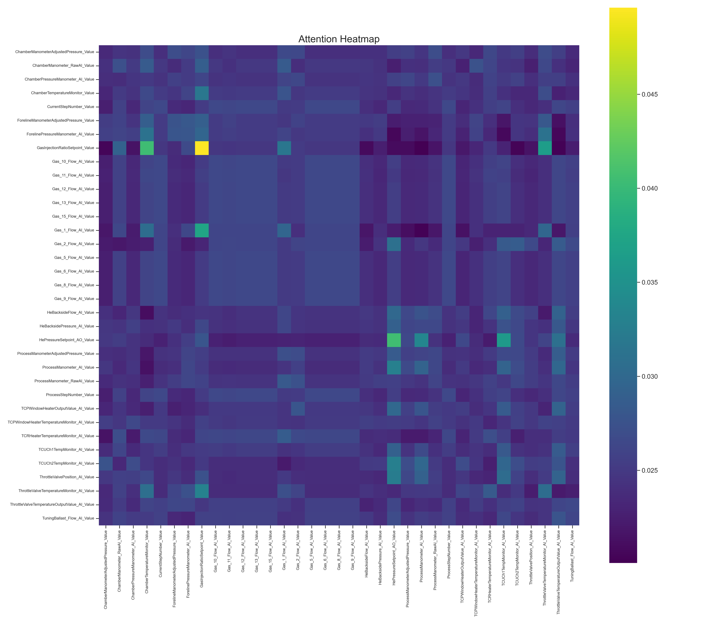
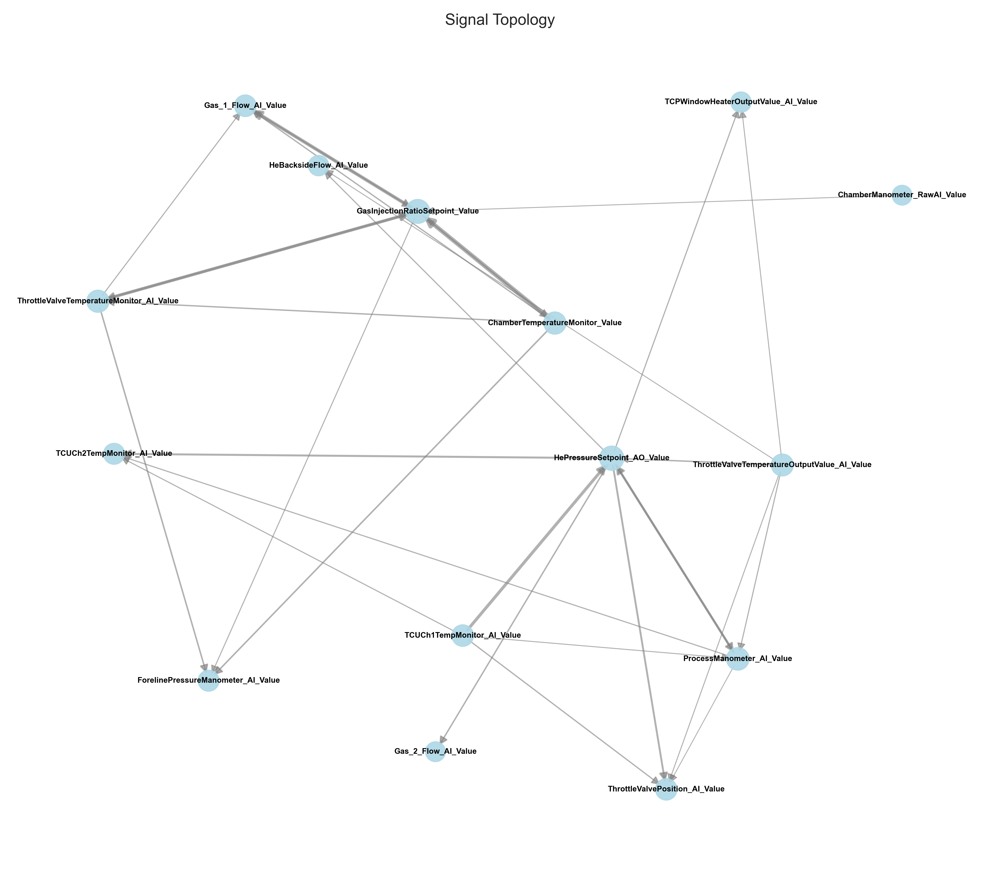
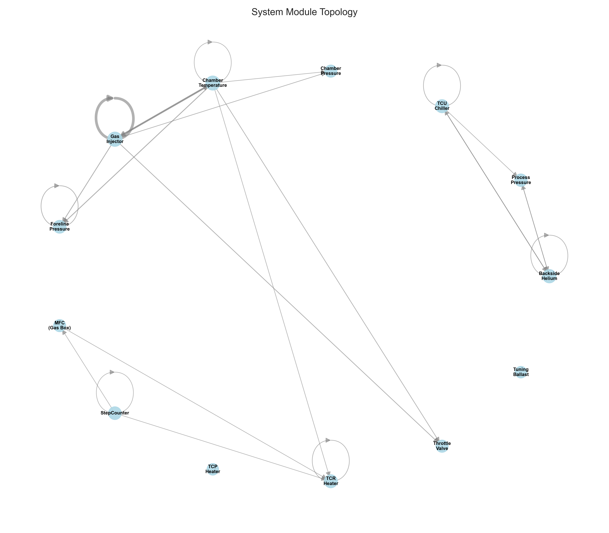

# AttentionGraph

## Overview
This project aims to perform data analysis and fault diagnosis of engineering systems.

## 📂 Project Structure

```text
AttentionGraph/
├── config/                 # Configuration files
│   ├── settings.yaml       # Global settings (paths, thresholds, preprocessing)
│   └── sensor_mapping.json # Mapping sensors to system modules (e.g., Gas, RF)
├── data/
│   ├── raw/                # Original WDL files
│   └── processed/          # Aligned and resampled CSVs
├── results/                # Experiment outputs (Model weights, Logs, Figures)
├── run_scripts/            # Execution scripts (PowerShell/Shell)
│   └── run_etch.ps1        # Script to trigger iTransformer training
├── src/                    # Source code
│   ├── analysis/           # Graph construction & result loading logic
│   ├── etl/                # Data preprocessing (ETL) logic
│   └── visualization/      # Plotting utilities
├── third_party/            # External submodules
│   └── iTransformer/       # Modified iTransformer source code
├── main_pipeline.py        # Entry point for Data Preprocessing
├── main_visualize.py       # Entry point for Graph Visualization
└── requirements.txt        # Python dependencies
```

## 🛠️ Environment Setup

### Requirements
- **Python**: 3.10+
- **CUDA**: 11.8+ (Recommended for GPU acceleration)

### Installation
The environment configuration is specified in `requirements.txt`.

1. **Create a virtual environment (Conda recommended):**
   ```bash
   conda create -n attention_graph python=3.10 -y
   conda activate attention_graph
   ```
2. **Install dependencies:**
   ```bash
   # Install PyTorch with CUDA support (Adjust version based on your GPU)
   pip install torch torchvision torchaudio --index-url [https://download.pytorch.org/whl/cu118](https://download.pytorch.org/whl/cu118)
   # Install project requirements
   pip install -r requirements.txt
   ```

## 🚀 Usage

Follow these steps to run the complete pipeline from raw data to visualization.

### Step 1: Data Preprocessing
Clean, align, and resample the raw data.
```bash
python main_pipeline.py
```
- Configuration: Controlled by config/settings.yaml.
- Process: Reads raw data, performs time alignment, resamples (e.g., to 200ms), and selects specific sensors.
- Output: Generates data/processed/custom_aligned.csv.

### Step 2: Model Training
Train the iTransformer model to capture temporal dependencies and extract attention weights.
```PowerShell
.\run_scripts\run_etch.ps1
```
- Note: This PowerShell script automatically handles directory switching to third_party/iTransformer.
- Mechanism: The model learns to forecast future sensor values. During inference, it exports the Attention Matrix (attention_weights.npy).
- Output: Saves model checkpoints and attention weights to the results/ folder.

### Step 3: Performacne Evaluation
Since the iTransformer performs **Time-Series Forecasting (Regression)** rather than classification, we evaluate the model using **$R^2$ Score**, **MSE**, and **MAE** on the **original physical scale** (inverse-transformed data).

To generate a comprehensive performance report, run:
```bash
python main_performance.py
```
The script automatically generates a 4-panel dashboard (performance_dashboard.png) in the results directory:

*(Result from `main_performance.py`)*
- Global Regression Fit (Scatter Plot): Compares Predicted vs. Ground Truth values. Ideally, points should align along the red diagonal line ($y=x$).
- Error Distribution: Shows the histogram of residuals. A narrow, zero-centered bell curve indicates a healthy model with no bias.
- Per-Sensor Predictability ($R^2$ Bar): Displays how well the model understands each sensor.
  - 🟢 High $R^2$ (> 0.8): Strong physical correlation captured (e.g., Pressure, Flow).
  - 🔴 Low/Negative $R^2$: Hard-to-predict variables (often constant setpoints, pure noise, or external operator inputs).
- Forecast Showcase: A random sample visualizing the temporal tracking capability of the model.
The script prints a ranked list of all sensors to the console, sorted by $R^2$ Score (Ascending).
Example Output:
```Plaintext
================================================================================
🏆 Model Performance Report
   Global R²  : 0.8717 (1.0 is perfect)
   Global MSE : 0.1036 (Original Scale)
   Global MAE : 0.0694 (Original Scale)
--------------------------------------------------------------------------------
Feature Name              | R² Score   | MSE          | MAE
--------------------------------------------------------------------------------
Sensor_12                 |   0.3043   |       0.0834 |   0.2188
Sensor_18                 |   0.4952   |       0.3875 |   0.0891
Sensor_7                  |   0.6585   |       0.2486 |   0.0712
Sensor_30                 |   0.7741   |       0.1607 |   0.0595
Sensor_13                 |   0.7987   |       0.2829 |   0.3013
================================================================================
```

### Step 4: Graph Construction & Visualization
Analyze the learned attention weights and generate topology graphs.
```bash
python main_visualize.py
```
- Logic: Automatically loads the latest experiment results.
- Output: Saves visualization figures (Heatmap, Signal Graph, Module Graph) to results/<experiment_id>/figures/.

## 📊 Visualization & Analysis

This project provides a comprehensive visualization pipeline to interpret the learned attention mechanisms from three different perspectives:

### 1. Attention Heatmap
The raw attention matrix capturing the correlation intensity between all sensor pairs.
- **X/Y Axis**: All sensor features.
- **Color**: Brighter/Darker colors indicate higher attention weights (stronger dependencies).


*(Result from `main_visualize.py`)*

### 2. Signal Topology
A directed graph showing the critical paths between specific sensors.
- **Filtering**: Edges are filtered using the `Mean + n * Std` threshold to remove noise.
- **Insight**: Reveals specific sensor-to-sensor strong dependencies.



### 3. Module Topology
A high-level system abstraction based on `sensor_mapping.json`.
- **Aggregation**: Sensors are grouped into functional modules.
- **Insight**: Displays the macroscopic interaction logic between different subsystems.



## ⚙️ Configuration Guide

Key parameters in `config/settings.yaml`:

| Parameter               | Default | Description |
|------------------------|---------|-------------|
| `resample_rate`        | `200ms` | The frequency for data resampling during preprocessing. |
| `threshold_std`        | `2.0`   | **For Signal Graph:** Controls edge filtering stringency. Higher value = fewer, stronger edges (*Mean + 2.0σ*). |
| `module_threshold_offset` | `0.4` | **For Module Graph:** Controls module connection sensitivity (*Mean + 0.4σ*). |
| `selection`            | `-`     | Defines which sensor columns to keep and which one is the target (OT). |
